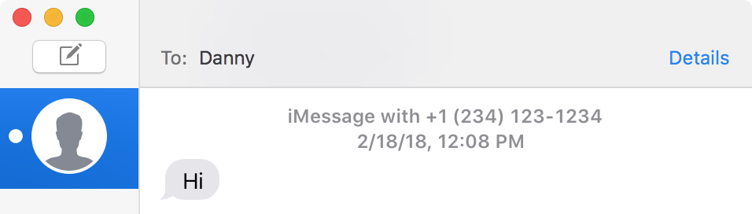

# WriteReceipt

# Information:

- WriteReceipt is a SIMBL plugin for Messages that leaves chats unread (and read receipts unsent) until you begin typing a reply (or press enter)
- Tested on macOS 10.13.4 (Messages 11.0)
- Author: [shishkabibal](https://github.com/shishkabibal)

# Installation:

1. Download [mySIMBL](https://github.com/w0lfschild/mySIMBL/)
2. Download [WriteReceipt](https://github.com/shishkabibal/WriteReceipt/releases/latest)
3. Unzip both downloads
4. Open `WriteReceipt.bundle` with `mySIMBL.app`
5. Restart Messages to load WriteReceipt

### Appeal:
Repurpose the code any way you like, but please don't just repackage it with your name. Remember to be nice to other people. If you make any changes and want to contribute, feel free to make a pull request.
